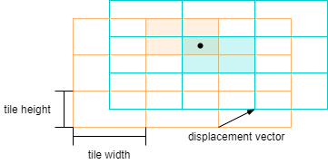

# RL-Agent


This is mainly an educational project, intended to get some hands-on experience with reinforcement learning. I created a bunch of interface classes and example implementations for a learning environment, learning algorithms, value function approximators and policies.

As you can see in the animation above, the currently implemented environment is inspired by [Flappy Bird](https://de.wikipedia.org/wiki/Flappy_Bird). The agent can accelerate the red rectangle in the upwards direction while gravity constantly accelerates it downwards. The speed in the horizontal direction is constant.

The theoretical concepts which I built this upon are from Sutton and Barto's Book ["Reinforcement Learning: An Introduction"](http://incompleteideas.net/book/bookdraft2017nov5.pdf).

## Setup

### Prerequisites
- OpenMP installed (```sudo apt-get install libomp-dev```)
- cmake version 3.5.2 installed

### Compile and Run
When the prerequisites are fullfiled you can simply execute `make run` in an elevated console. This compiles the program and starts learning an optimal control policy. Informations about the learning progress are printed to the console and also stored in a CSV file located at `./run/YOUR_USERNAME/YYYY-MM-DD/hhmmss/data`.

If you don't want to use the mentioned folder structure you can alternatively just compile the code with `make compile` and then execute `./build/rlagent -exec learn -wdir SOME_DIRECTORY`. The command line argument `-wdir` lets you specify where the parameters and learning progress statistic files shall be stored.

To execute one (or multiple) epochs with an already learned policy, just change into the directory of interest (`cd ./run/YOUR_USERNAME/YYYY-MM-DD/hhmmss`) and then execute `./build/rlagent -exec play -wdir data/`.

## Environment

The environment is called "FlappySimulator". It can be observed through an five dimensional state vector with the following entries:
- **PIPE_1_X** The horizontal position of the pipes. Since the distance between the pipes is constant there is no need for a sperated entry with the second pipe's horizontal position.
- **PIPE_1_Y** The vertical middle point between the first pipe's openings (the area where the agent can fly through).
- **PIPE_2_Y** The vertical middle point between the second pipe's openings (the area where the agent can fly through).
- **FLAPPY_Y** The vertical center position of the red rectangle (the player).
- **FLAPPY_V** The vertical velocity of the red rectangle (the player).

## Policy

So far a simple -greedy policy is implemented. It selects greedily an action with probability 1- or a random action with probability . During the learning phase it is possible to decrease  after each batch of episodes. By doing so we start with high exploration and shift to high exploitation over the course of learning.

## Learning Algorithm

The implemented learning algorithm is n-step SARSA. This is an online learning algorithm. For details check out Sutton and Barto's Book.
Depending on your CPU, multiple episodes which work with and improve the same policy are executed in parallel using OMP.

## Value Function Approximation

Two value function approximators are available so far. One is a simple state aggregation which assigns nearby areas of the state space to the same discretized state value. An extension of this approach is implemented with Tile Coding. Here multiple state aggregation approximators are used while each of them has a slight offset (displacement). More details can also be found in the mentioned Book.


